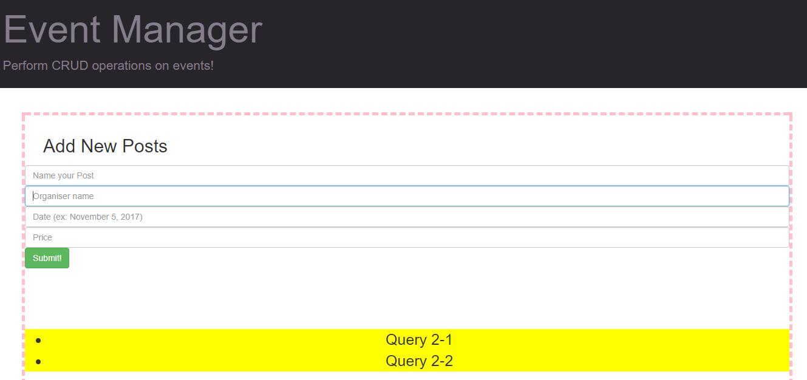
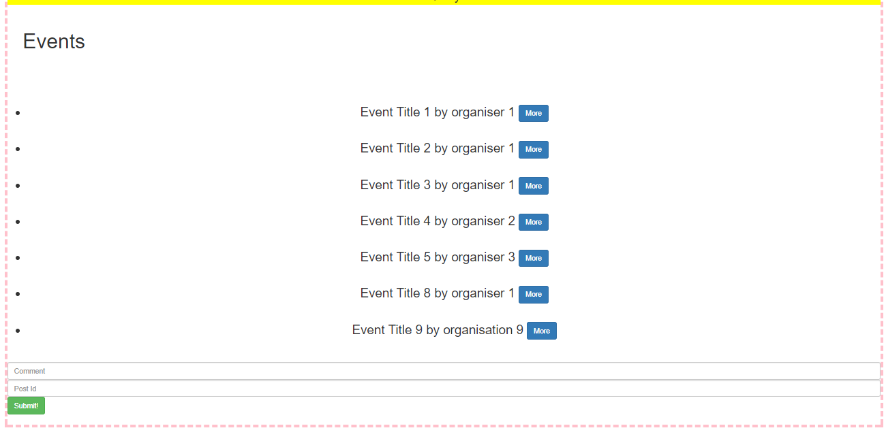

# Event Manager

*This project was bootstrapped with [Create React App](https://github.com/facebookincubator/create-react-app).*

#### This is an application made using react to perform CRUD operations on a list of events.
* All the important APIs used in this project are present in this [link]('https://www.getpostman.com/collections/765a863c27af1960eba8').
* To start the application set up the node environment and clone the [repository](https://github.com/falcon1996/cashpositive).
* Go to **eventmanager** directory and start the react server by `npm start`. 

